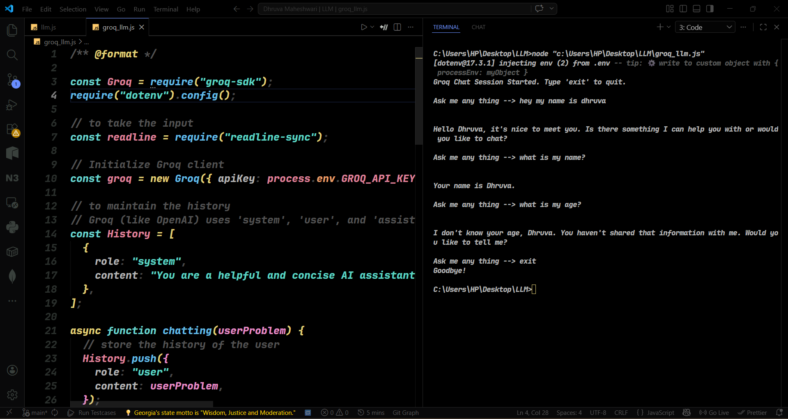

<!-- @format -->

# Simple CLI Chatbots (Gemini & Groq)



A simple command-line chat interface built with Node.js. This repository contains two versions of a terminal chatbot:

1. A Google Gemini chatbot using the official `@google/genai` library.
2. A fast, open-source model chatbot (using Llama 3) via the `groq-sdk`.

Both applications allow you to have a continuous conversation with AI directly from your terminal, automatically maintaining conversation history along the way.

## Prerequisites

- [Node.js](https://nodejs.org/) installed on your machine
- A [Google Gemini API Key](https://ai.google.dev/) (for the Gemini version)
- A [Groq API Key](https://console.groq.com/) (for the Groq version)

## Installation

1. Clone or download this project to your local machine.
2. Open your terminal and navigate to the project directory.
3. Install the required dependencies:

```bash
npm install
```

## Configuration

1. Create a file named `.env` in the root of your project directory.
2. Add your API keys to the `.env` file like this:

```env
GEMINI_API_KEY=your_gemini_api_key_here
GROQ_API_KEY=your_groq_api_key_here
```

## Usage

**Start the Google Gemini chatbot:**

```bash
node llm.js
```

**Start the Groq (Llama 3) chatbot:**

```bash
node groq_llm.js
```

You will see a prompt: `Ask me any thing --> `. Type your question and press Enter to chat. Both scripts maintain conversational history, allowing for follow-up questions. Type `exit` to close the Groq version gracefully.

## Dependencies

- `@google/genai` - Official Google Gen AI SDK
- `groq-sdk` - Official Groq SDK for insanely fast inference
- `dotenv` - For loading environment variables from a `.env` file
- `readline-sync` - For reading user input synchronously from the command line
